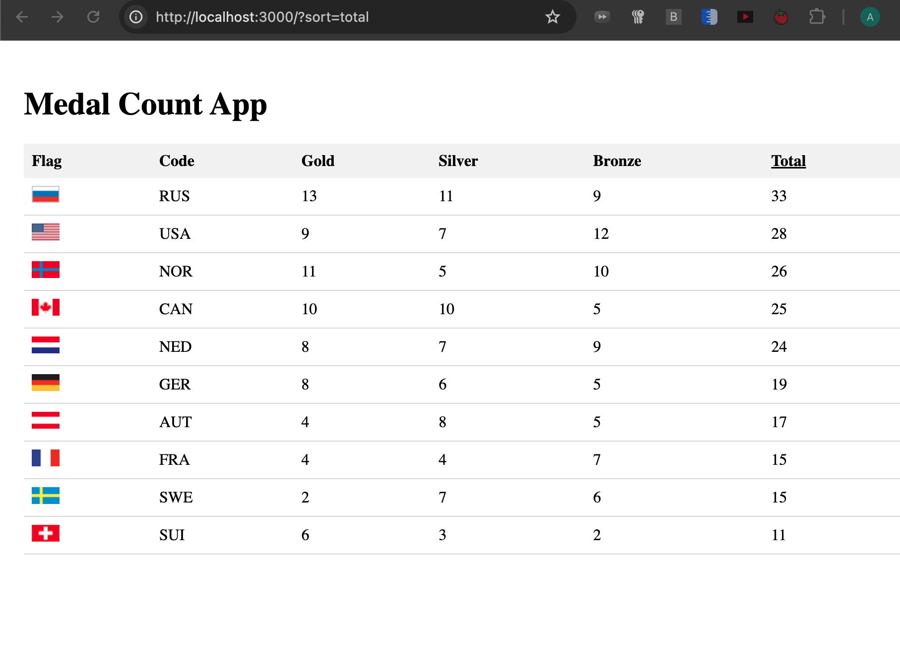

# 🥇 Medal Count Mini App

A mini app built with **Next.js** and **TypeScript** to display Olympic medal standings. Developed as a take-home test, designed to demonstrate production-quality code, sorting logic, UI rendering, and architecture.

---

## 🚀 Features

- ✅ Fetches dynamic medal data via simulated API
- ✅ Sorting by `gold`, `silver`, `bronze`, or `total` medals
- ✅ Tiebreak rules implemented per spec
- ✅ Flags rendered using sprite sheet (`flags.png`)
- ✅ Clickable column headers with shallow routing
- ✅ Responsive table with fallback for small screens
- ✅ Graceful loading and error handling

---

## 📷 Screenshots



---

## 🔧 Tech Stack

- Framework: **Next.js** (React + SSR)
- Language: **TypeScript**
- State/Data: Local state via `useState`, custom hooks
- Styling: Inline styles (CSS modules used for flag sprite)
- Assets: `medals.json`, `flags.png`

---

## 🧪 How to Run Locally

```bash
# 1. Clone the repo
git clone https://github.com/contactashpat/medal-count-app.git
cd medal-count-app

# 2. Install dependencies
npm install

# 3. Run dev server
npm run dev
